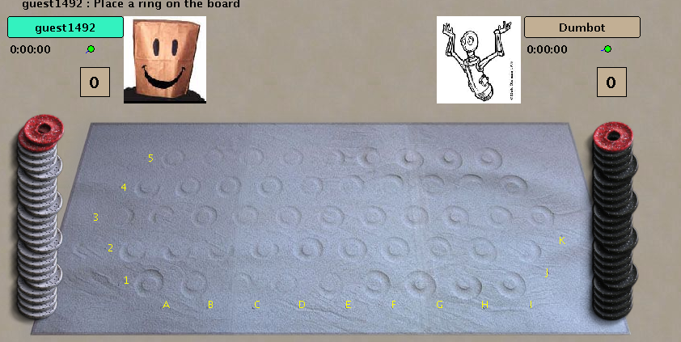

# dumberbot
A bot that beats Dumbot. This is currently only meant to work on a MacBook Air (mid-2013) with its built in display (non-retina) on OSX El Capitan.



## Replay previous DVONN games (in SGF format)

```
yarn view-sgf [path to SGF file]
```

## Todo

- Score the board
  - Absolute score (count fully surrounded pieces)
  - Effective score (don't count pieces that are fully surrounded)

- Strategy: minimax
  - Calculate move that will minimize max possible score for the opponent's next move (board state in 2 moves)

- Strategy: maximin
  - Calculate move that will maximize min possible score for self after opponent's next move (board state in 2 moves)


- Handle Placement phase
  - Count placed tokens
  - Enable board pruning after placement phase is over
  - Locality: tendency to occupy positions that have low locality (disperse own rings evenly)

- Implement basic strategy using disposition, locality, and composition
  - Compute defensive values for every cell on the board
  - Compute offensive values for every cell on the board
  - Decide whether to make a defensive move or an offensive move

  - Disposition: use this to determine the offensive value of a move (weight: 2)
    - tendency to attack into a position of low disposition
  - Enemy composition: use this to determine the offensive value of a move (weight: 1)
    - tendency to attack into a position where there is a high composition of enemy rings
  - Own locality: use this to determine the defensive value of a move (weight: 1)
    - tendency to move from areas of low locality
    - tendency to move into areas of high locality

---

## Quick start

### 1. Start the bot with BoardSpace DVONN game client opened: `./index.ts` or `yarn start` 
### 2. Run the test script: `./test.ts`

### Architecture

```
1. BoardSpaceInterface 
  - controls human player; assumes BoardSpace client 
    is open and DVONN game has commenced
  - should know whose turn it is 
  - should be able to query the game state
  - should be able to make moves
  - should be able to determine when a game has ended (---)

2. Board
  - manages board state
  - calculates tile values, legal moves
  - maintains history

3. SGFParser
  - step forward, step back through frames
  - outputs a human readable string describing the move
  - segregate game phases: placement phase and in-play phase
  - calculate game length in "frames"

4. TacticsLayer
5. StrategicLayer

6. GameViewer
  - step through each frame of a DVONN SGF replay
  - show statistics about current board

```

## General Tactics

### Next-move metrics

**Composition** is the percentage of rings in a stack that belongs to a color. A lower composition is favored as the target of the next move.
 
**Disposition** is the number of defenders of a stack. Enemy disposition is the number of available 
stacks the enemy has to cover a position, vs own disposition which is the number of stacks you have
that can move on top of the position of interest.

**Locality** is the density of stacks of the same color in a neighborhood of 7 positions (1 central + 6 adjacent).

### Strategies

An average game lasts about 90 - 100 moves. (Scrape game archives for statistics)

0. Placement phase (no look ahead)
  - Rings should be placed to maximize uniformity of spread.
    Concentration is bad.

1. Early-game (1 move look ahead)
  - Rings should be placed near the control rings.
    Being far away from control rings is bad.
  - Move stacks with low locality first, aim to maximize locality in preparation for positional plays mid-game.
  - Secondarily, move stacks with the aim of minimizing composition across the board.

2. Mid-game (4 move look ahead)
  - Maximize locality of all positions to avoid being cut off.
  - Minimize disposition of enemy positions.

3. End-game (maximum look ahead)
  - Move stacks to minimize enemy disposition.


---------


## Historical game statistics

1. Download all SGF files for analysis from the boardspace DVONN game archive with [`wget`](https://stackoverflow.com/a/8756067)

```
wget -A sgf,zip -m -p -E -k -K -np https://www.boardspace.net/dvonn/dvonngames/

# Then move all subdirectory files to current directory
# https://superuser.com/a/419113
find . -type f -mindepth 2 -exec mv -i -- {} . \;

# Remove all subdirectories, leaving files alone
rm -R ./*/

```

We want to look at how long a game plays out for (in # of frames). This will let us estimate the phase of the game as it proceeds: 

```
i.e.  from frame 0 to frame 30 is the placement phase,
      from frame 31 to frame 50 is the early-game phase
      from frame 51 to frame 63 is the mid-game phase
      from frame 64 onwards is the end-game phase
```

9708 archived games in SGF.

2. Some of these have resignations: discard ones with resignations.

```
# Run script to find games and rename games with resignations
./rename-sgf-with-resignations.ts

mkdir sgf-games-with-resignations
mv sgf/*.resign.sgf sgf-games-with-resignations/
```

**9597** games played till the end.

Some of these games are in a different format than the latest:
e.g.
```
P0[id "aanno"]
P1[id "Dumbot"]
; P0[0 Start P0]
; P0[1 pick wr 2]
            ^--------- Picks up from the start pile
```

